# Secure Admin Portal

A standalone Angular 22 admin portal demonstrating authentication, protected routing, API-backed product management, and RxJS search.

## Live demo

[Open the deployed Secure Admin Portal](https://metizsoft-angular-practical.vercel.app/) or https://metizsoft-angular-practical.vercel.app/

Demo credentials:

- Username: `emilys`
- Password: `emilyspass`

## Features

- Reactive-form login with validation, loading state, and feedback notifications
- DummyJSON authentication with persisted token and user session
- Functional auth guard and HTTP bearer-token interceptor with 401 handling
- Lazy-loaded login and dashboard routes
- Product list, create, edit, delete, refresh, API-backed debounced search, and category filtering
- Responsive enterprise-style table with loading, empty, and error states

## Run locally

```bash
npm install
npm start
```

Open `http://localhost:4200` and sign in with the demo credentials above.

## Structure

```
src/app/
  core/          models, auth/product services, guard, interceptor
  shared/        notification service and toast component
  features/auth/ lazy-loaded login feature
  features/dashboard/ lazy-loaded secured product dashboard
```

## Architecture

`AuthService` authenticates through DummyJSON's `/auth/login` endpoint. Its API-issued JWT access token and minimal user profile are stored in localStorage. `authGuard` blocks dashboard navigation when no token exists and redirects visitors to `/login?returnUrl=%2Fdashboard`. `authInterceptor` attaches the stored access token as a bearer token to authenticated calls and clears the session after a 401 response.

The dashboard uses DummyJSON Products. Product mutations call the corresponding endpoint and refresh the list afterwards. Search uses a reactive form control with `debounceTime`, `distinctUntilChanged`, and `switchMap`, invoking DummyJSON's `/products/search` endpoint. Categories are loaded from `/products/categories`; changing the category uses the category API endpoint. The **Clear** button resets both controls.

## Visual requirement verification

Each screenshot below maps to a requirement in the assignment. To verify the portal, follow the steps in order using the demo credentials above.

> Screenshots are referenced from the existing `screenshots/` directory so they render in GitHub and remain easy to inspect alongside the README. Image files cannot be stored inside Markdown itself in a portable, GitHub-renderable way.

### 1. Authentication flow

#### 1.1 Auth Guard protects the dashboard

Open `/dashboard` without signing in. The guard redirects to `/login` and preserves the intended dashboard URL as `returnUrl`.

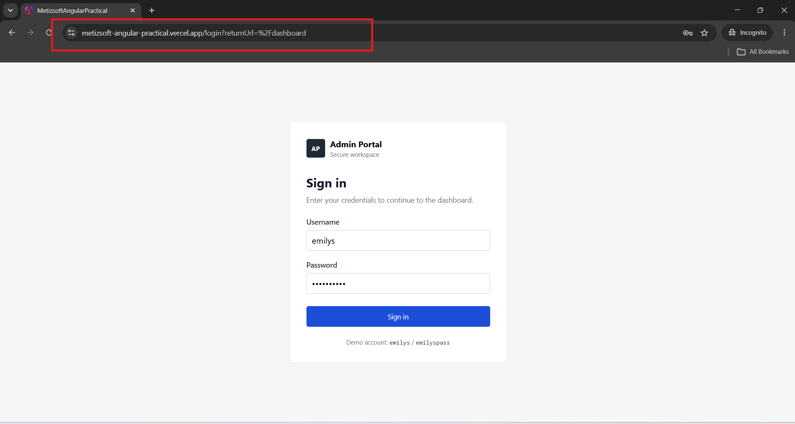

#### 1.2 Reactive Form validation

Submit the login form with required fields empty. The form shows validation messages before an API request can be made.

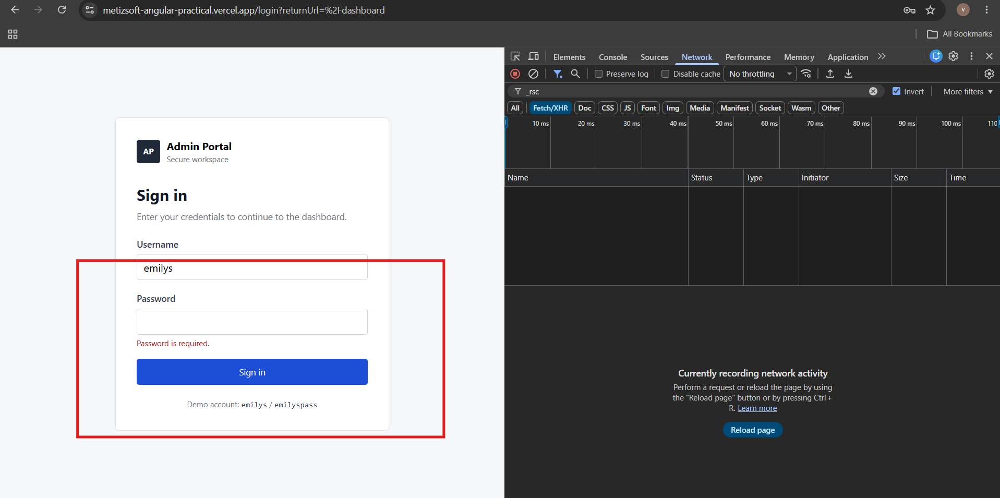

#### 1.3 Invalid credentials show an error notification

Enter an invalid username or password and submit. The failed authentication attempt displays a toast notification.


#### 1.4 Loading state during authentication

Submit valid credentials. The login button shows its loading state while the authentication request is pending.

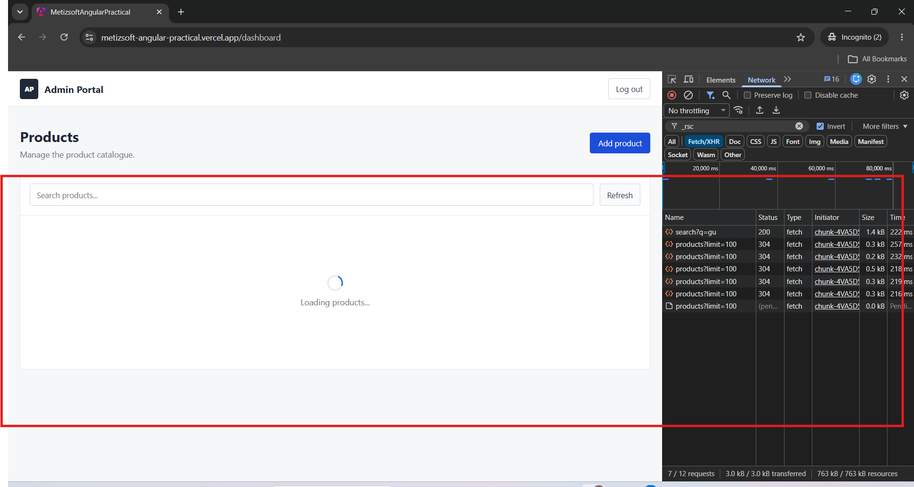

#### 1.5 Token persistence after successful login

After successful authentication, inspect browser local storage. The access token and user session are stored for the protected session.

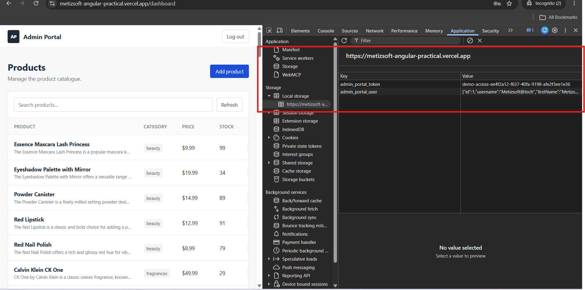

#### 1.6 Logout clears the protected session

Select **Log out** in the dashboard. The session is removed and the user is returned to the login page.

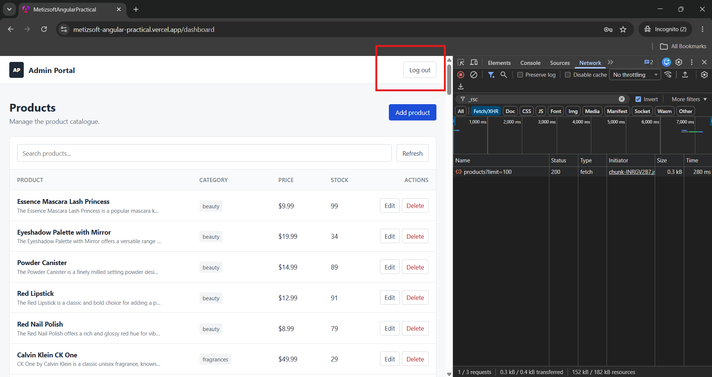

### 2. Dashboard: data, CRUD, search, and filter

#### 2.1 View records from the fake API

Sign in successfully. The protected dashboard fetches and displays the product list from DummyJSON.

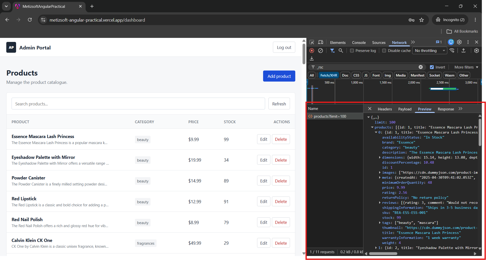

#### 2.2 Add a product

Select **Add product**, complete the Reactive Form, and save. The new record is added to the visible product list.

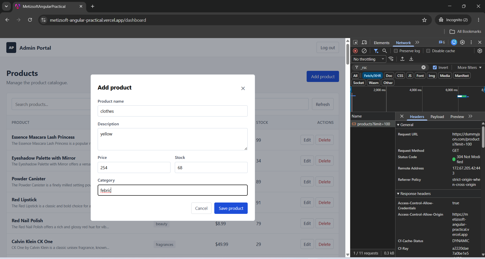

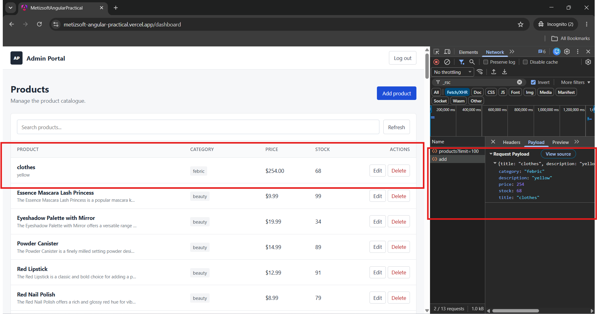

#### 2.3 Edit a product

Select **Edit** for a product, update its values, and save. The table reflects the updated record.

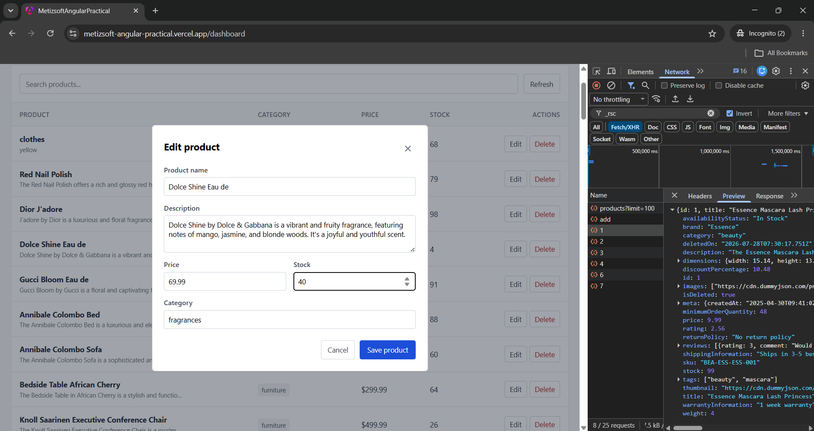

#### 2.4 Delete a product

Select **Delete**, then confirm the dialog. The record is removed from the displayed list.

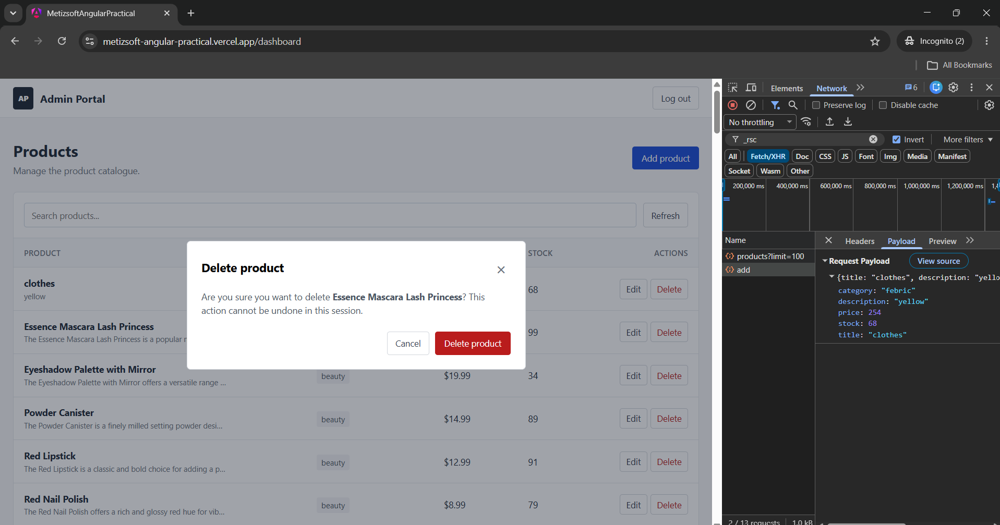

#### 2.5 API-backed search

Type a search term in the search box. The debounced request calls DummyJSON's `/products/search` API and displays the matching products.

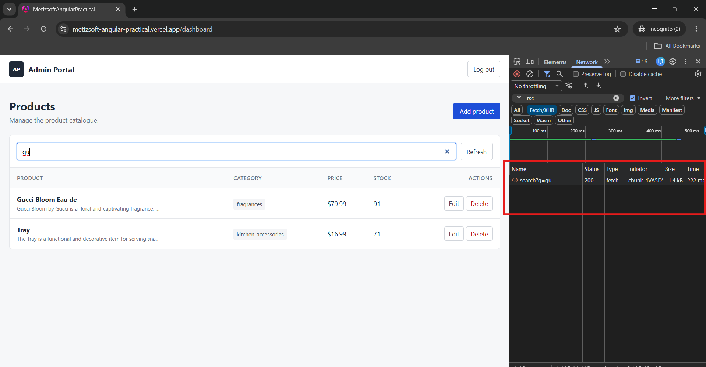

#### 2.6 Category filter and clear action

Choose a category from the filter dropdown. Products are fetched through the matching category API endpoint. Use **Clear** to reset both the category and search term.

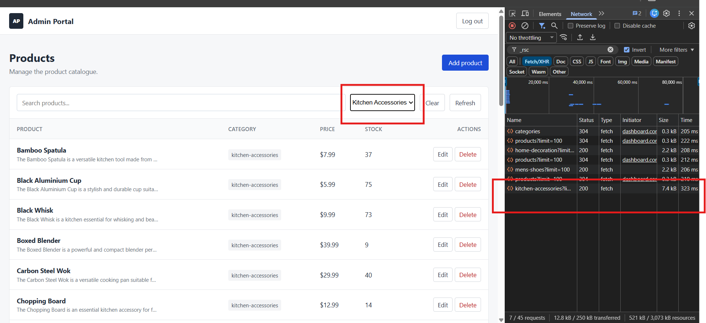

### 3. API security

#### HTTP interceptor attaches the authorization header

In browser DevTools, inspect a product API request after login. The HTTP interceptor automatically adds `Authorization: Bearer <token>` to authenticated requests.

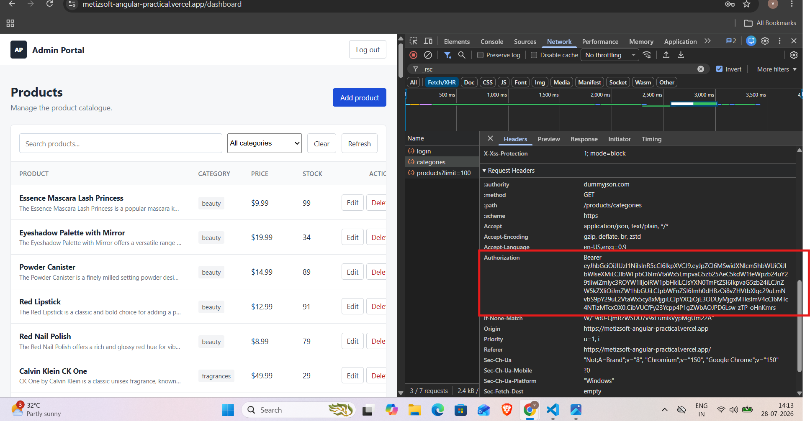

### 4. UI and error feedback

The dashboard uses a responsive, professional CSS layout with loading, empty, error, modal, confirmation, and toast states. The following example confirms success feedback is presented as a toast notification.

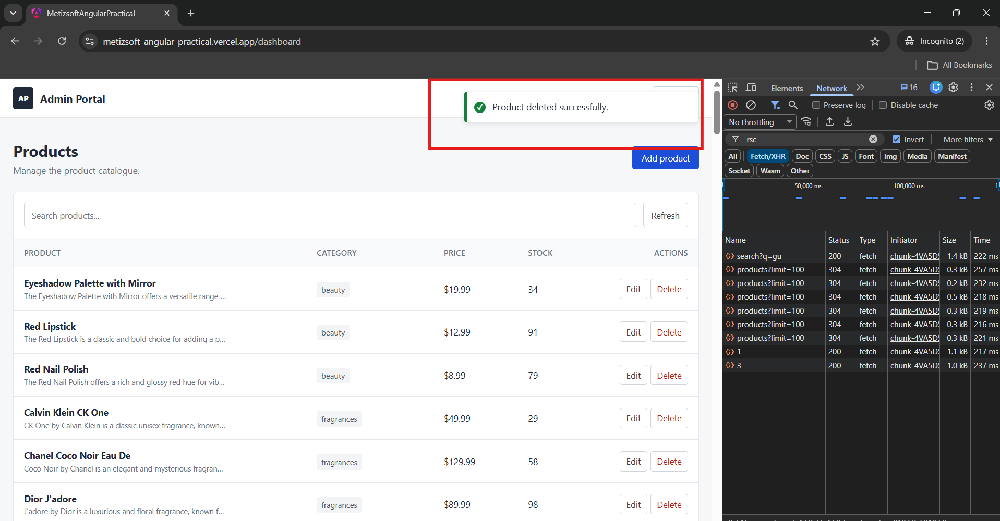
